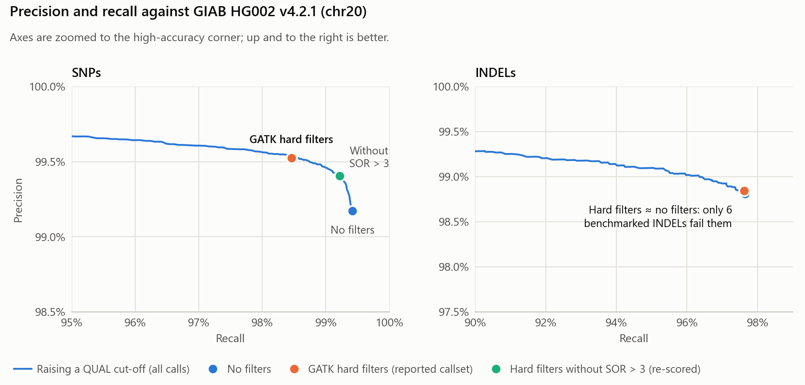

# wgs-germline-nf

A reproducible **germline whole-genome short-variant pipeline** that takes raw reads
to an annotated, filtered VCF following **GATK4 best practices**, orchestrated in
**Nextflow DSL2** with per-process **Docker** containers and an **AWS Batch** profile.

Variant filtering is **rule-based** (GATK hard filters) — deliberately **no machine
learning** (no VQSR, which fits a Gaussian mixture model). Calls are benchmarked
against the **Genome in a Bottle HG002** truth set with **hap.py**.

```
FASTQ ─► FastQC ─► BWA-MEM ─► sort ─► MarkDuplicates ─► BQSR
      ─► HaplotypeCaller (GVCF) ─► CombineGVCFs ─► GenotypeGVCFs
      ─► hard-filter (SNP/INDEL) ─► SnpEff ─► bcftools stats + VCF summary ─► MultiQC
                                          └► hap.py vs GIAB HG002  (--benchmark)
```

See [`docs/architecture.md`](docs/architecture.md) for the full DAG.

## Results: HG002 chr20 benchmark

Scored with hap.py against the GIAB HG002 v4.2.1 truth set on chromosome 20
(~29× coverage), inside the GIAB high-confidence regions:

| Hard-filtered calls (PASS) | Precision | Recall | F1 |
|---|---:|---:|---:|
| SNPs   | 99.53% | 98.46% | 0.9899 |
| INDELs | 98.85% | 97.62% | 0.9823 |



- The PASS callset has a Ti/Tv of 1.99. Its true-positive SNPs match the truth set's 2.31.
- For SNPs, the hard filters removed 686 true variants to remove 256 false ones.
  `SOR > 3` caused most of the loss; without that one rule, F1 rises from 0.9899 to 0.9931.
- A single QUAL cut-off matches the seven SNP hard filters at equal precision.
  Long insertions are the hardest variants: 93.5% recall at 16 bp or more.

Full write-up with methods, limitations and every table: [`report/`](report/README.md).

## Quick start

```bash
# 1. reference + known-sites + GIAB truth (one-time, large)
./download_data.sh --refs --truth --reads     # or: --all

# 2. fast local end-to-end check on chr20 (WSL2 + Docker on Windows)
nextflow run . -profile test,docker --input assets/samplesheet.csv

# 3. full genome + benchmark (recommended on AWS Batch)
nextflow run . -profile awsbatch -w s3://BUCKET/work \
    --input assets/samplesheet.csv --outdir s3://BUCKET/results --benchmark

# 4. benchmark tables + figures from a finished run (needs pandas, matplotlib)
python report/make_report.py --results results
```

Full instructions, parameters, and caveats: [`docs/usage.md`](docs/usage.md).
Output layout: [`docs/output.md`](docs/output.md).

## What each stage does

| Stage | Tool | Purpose |
|-------|------|---------|
| Read QC | FastQC (+ optional fastp) | raw-read quality; optional trimming |
| Align | BWA-MEM (alt-aware) → samtools | map reads to GRCh38, sort, index |
| Dedup | GATK MarkDuplicates | flag PCR/optical duplicates |
| Recalibrate | BaseRecalibrator + ApplyBQSR | correct systematic base-quality error |
| Call | HaplotypeCaller (`-ERC GVCF`) | per-sample variant calling |
| Joint-genotype | CombineGVCFs + GenotypeGVCFs | cohort VCF |
| Filter | SelectVariants + VariantFiltration | **rule-based** SNP/INDEL hard filters |
| Annotate | SnpEff + SnpSift | gene / consequence / impact |
| QC | bcftools stats, `vcf_summary.py`, MultiQC | Ti/Tv, het/hom, PASS rate, one report |
| Benchmark | hap.py vs GIAB HG002 v4.2.1 | precision / recall / F1 (`--benchmark`) |

## Hard-filter thresholds (GATK germline)

**SNPs:** `QD<2 · QUAL<30 · SOR>3 · FS>60 · MQ<40 · MQRankSum<-12.5 · ReadPosRankSum<-8`
**INDELs:** `QD<2 · QUAL<30 · FS>200 · ReadPosRankSum<-20 · SOR>10`

## Data sources

- Reference + known-sites: GATK GRCh38 resource bundle (`gcp-public-data--broad-references/hg38/v0`).
  The chr20 test uses UCSC hg38 chr20 with chr20 subsets of the bundle's known sites.
- Sample: GIAB **HG002** (Ashkenazi son). Whole-genome input is Illumina 2×250
  (`download_data.sh --reads`). The chr20 benchmark input is 2×148 reads streamed
  from the GIAB 300× GRCh38 BAM and downsampled to ~29× (`make_test_data.sh`).
- Truth: GIAB **HG002 GRCh38 v4.2.1** benchmark VCF + high-confidence BED

## Repo layout

```
main.nf · nextflow.config · download_data.sh
modules/            fastqc · fastp · bwa_mem · samtools_sort · markduplicates · bqsr ·
                    haplotypecaller · joint_genotyping · hard_filter · snpeff ·
                    bcftools_stats · vcf_summary · happy · multiqc
bin/                vcf_summary.py · check_samplesheet.py   (dependency-free)
assets/             samplesheet.csv · multiqc_config.yaml
docs/               usage · output · architecture
report/             HG002 chr20 benchmark write-up · figures · tables · make_report.py
```

Execution profiles (`docker`, `singularity`, `test`, `awsbatch`) live in `nextflow.config`.

## Requirements

Nextflow ≥ 23.04, Java 11+, and Docker (or Singularity). On Windows, run inside
**WSL2 + Docker Desktop**. Containers are pulled per process, so no manual tool
installs are needed.
