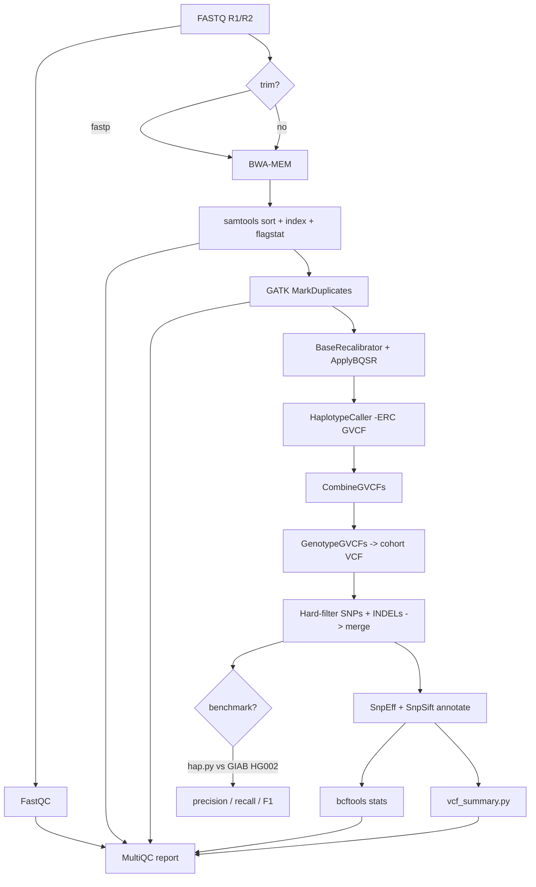

# Pipeline architecture

```mermaid
flowchart TD
    A[FASTQ R1/R2] --> B[FastQC]
    A --> C{trim?}
    C -->|fastp| D[BWA-MEM]
    C -->|no| D[BWA-MEM]
    D --> E[samtools sort + index + flagstat]
    E --> F[GATK MarkDuplicates]
    F --> G[BaseRecalibrator + ApplyBQSR]
    G --> H[HaplotypeCaller -ERC GVCF]
    H --> I[CombineGVCFs]
    I --> J[GenotypeGVCFs -> cohort VCF]
    J --> K[Hard-filter SNPs + INDELs -> merge]
    K --> L[SnpEff + SnpSift annotate]
    L --> M[bcftools stats]
    L --> N[vcf_summary.py]
    K --> O{benchmark?}
    O -->|hap.py vs GIAB HG002| P[precision / recall / F1]
    B & E & F & M & N --> Q[MultiQC report]
```

**No machine learning:** variant filtering uses GATK's documented hard-filter
thresholds (rule-based), deliberately not VQSR (which fits a Gaussian mixture model).
