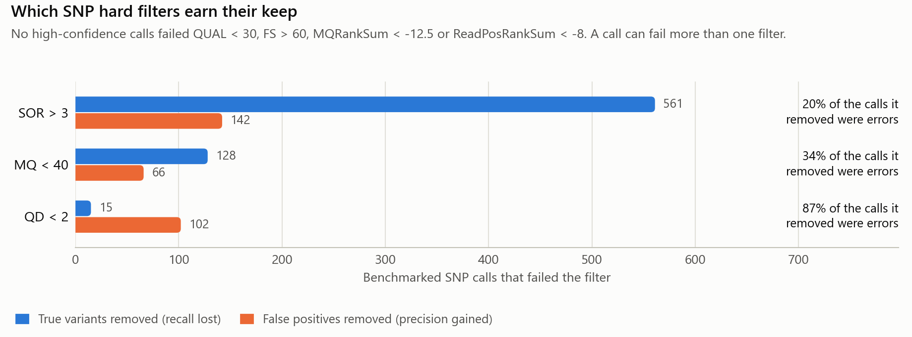
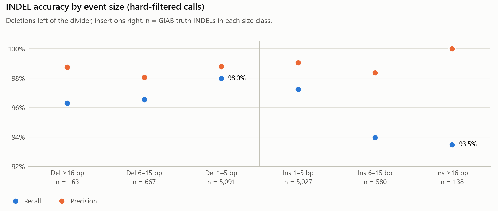
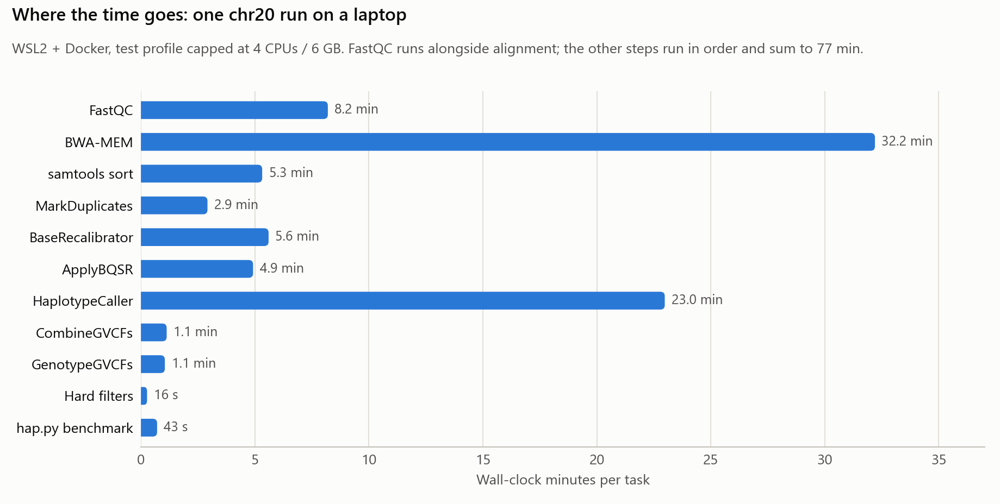

# Benchmark report: HG002 chr20 against GIAB v4.2.1

This report measures how accurately the pipeline in this repository calls germline
SNPs and INDELs, using the Genome in a Bottle (GIAB) HG002 truth set as the answer
key. It also asks a design question the pipeline raises: **what do the GATK hard
filters actually buy, given that the pipeline uses them instead of a trained
model (VQSR)?**

Every number below comes from the tables in [`tables/`](tables/), which
[`make_report.py`](make_report.py) builds directly from the pipeline's outputs.

## Summary

| Hard-filtered calls (PASS) | Precision | Recall | F1 | True positives | False negatives | False positives |
|---|---:|---:|---:|---:|---:|---:|
| SNPs   | 99.53% | 98.46% | 0.9899 | 70,233 | 1,100 | 335 |
| INDELs | 98.85% | 97.62% | 0.9823 | 10,988 | 268 | 133 |

*HG002, chromosome 20, about 29× coverage, scored with hap.py inside the GIAB
high-confidence regions (56.9 Mb, 89% of the non-N sequence of chr20).*

**Findings**

1. **Accuracy is high.** Inside the high-confidence regions, 99.5% of PASS SNP
   calls and 98.8% of PASS INDEL calls are correct. The pipeline recovers 98.5% of
   true SNPs and 97.6% of true INDELs.
2. **For SNPs, the hard filters cost more recall than they return in precision.**
   They removed 686 true SNPs to get rid of 256 false ones, so F1 fell from 0.9930
   (no filters) to 0.9899. One rule, `SOR > 3`, accounts for 561 of the 686 lost
   true SNPs. Dropping only that rule gives the best F1 of any setting tested: 0.9931.
3. **A single QUAL cut-off does as well as the seven SNP rules.** At the same
   precision as the hard-filtered SNP calls, a QUAL cut-off of about 107 keeps
   slightly more true SNPs: 98.53% vs 98.46%.
4. **Long insertions are the hardest variants.** Recall is 93.5% for insertions of
   16 bp or more, against 98.0% for 1–5 bp deletions. Most INDEL false positives
   (104 of 133) are at real variant sites with the wrong allele or genotype, not
   calls where no variant exists.


## 1. Setup

### Data

| | |
|---|---|
| Sample | GIAB HG002 (NA24385, Ashkenazi son) |
| Reads | 6,220,215 read pairs, 2×148 bp (1.84 Gb), streamed for chr20 from the GIAB HG002 300× Illumina GRCh38 BAM and downsampled to 10% (`make_test_data.sh`, samtools seed 0) |
| Coverage | 28.8× raw (sequenced bases ÷ 63.9 Mb of non-N chr20) |
| Reference | UCSC hg38 chr20 |
| Known sites (BQSR) | dbSNP 138 and Mills + 1000G gold-standard INDELs, chr20 subsets of the GATK GRCh38 bundle |
| Truth set | GIAB HG002 GRCh38 v4.2.1 benchmark VCF + `noinconsistent` high-confidence BED, chr20: 71,333 SNPs and 11,256 INDELs in 56.9 Mb |

Chromosome 20 is the standard held-out chromosome for small-variant benchmarks.
It is small enough to run end to end on a laptop and still gives real
precision and recall numbers.

### Pipeline

| Step | Tool (container version) |
|---|---|
| Read QC | FastQC 0.12.1 |
| Alignment | BWA-MEM 0.7.17 → samtools 1.17 sort/index/flagstat |
| Duplicate marking | GATK 4.5.0.0 MarkDuplicates |
| Base quality recalibration | GATK BaseRecalibrator + ApplyBQSR |
| Calling | GATK HaplotypeCaller `-ERC GVCF` |
| Joint genotyping | GATK CombineGVCFs + GenotypeGVCFs |
| Filtering | GATK SelectVariants + VariantFiltration (hard filters below) |
| Callset QC | bcftools 1.17 stats, `bin/vcf_summary.py`, MultiQC 1.21 |
| Benchmark | hap.py v0.3.12 (xcmp engine, ROC on QUAL) |

Hard filters, as recommended by GATK for germline data:

- **SNPs:** `QD < 2`, `QUAL < 30`, `SOR > 3`, `FS > 60`, `MQ < 40`, `MQRankSum < -12.5`, `ReadPosRankSum < -8`
- **INDELs:** `QD < 2`, `QUAL < 30`, `FS > 200`, `ReadPosRankSum < -20`, `SOR > 10`

The run used Nextflow 26.04.4 with Docker on WSL2 (Ubuntu) and the `test`
profile, which caps every task at 4 CPUs and 6 GB:

```bash
nextflow run . -profile test,docker --input assets/samplesheet.chr20.csv --skip_snpeff
```

SnpEff annotation was skipped. It does not affect the benchmark, because hap.py
scores the hard-filtered VCF before annotation.

### How the calls are scored

hap.py compares the pipeline's VCF with the truth VCF inside the high-confidence
regions and labels each call:

- **True positive (TP):** the call matches a truth variant.
- **False positive (FP):** the call is not in the truth set, or has the wrong allele or genotype.
- **False negative (FN):** a truth variant the pipeline missed.
- **Unknown (UNK):** the call is outside the high-confidence regions, so it is not scored.

**Precision** = TP / (TP + FP), the share of calls that are right. **Recall** =
TP / (TP + FN), the share of real variants found. **F1** is their harmonic mean.
hap.py reports every metric twice: **ALL** counts every call, including filtered
ones, and **PASS** counts only calls that passed the hard filters.

## 2. Results

### 2.1 Reads and alignment

| Metric | Value |
|---|---:|
| Read pairs | 6,220,215 |
| Mapped reads | 99.7% |
| Properly paired | 98.55% |
| Duplicate rate (MarkDuplicates) | 0.23% |

Nearly every read maps and pairs are consistent. That is expected here, because
the reads were selected by their original chr20 alignment (see
[Limitations](#4-limitations)). Duplication is negligible. Nothing points to a
read-quality or alignment problem.

### 2.2 The callset

| Metric | Value |
|---|---:|
| Variant records | 126,976 |
| PASS records | 116,904 (92.1%) |
| SNP / INDEL records | 106,407 / 20,348 |
| Ti/Tv, PASS callset | 1.99 |
| Ti/Tv, PASS true positives | 2.31 (truth set: 2.31) |
| Ti/Tv, PASS false positives | 1.41 |
| Ti/Tv, PASS calls outside the high-confidence regions | 1.39 |

The transition/transversion ratio (Ti/Tv) is a quick check of SNP quality. Real
human SNPs are enriched for transitions, while random errors are not. The PASS
callset's Ti/Tv of 1.99 sits near the roughly 2.0 expected for whole-genome data.
The breakdown shows why it is below the truth set's 2.31. The true positives match
the truth set's 2.31, and the shortfall comes from false positives and calls
outside the high-confidence regions, whose Ti/Tv is much lower (1.39–1.41).

### 2.3 Accuracy against GIAB

| Callset | Type | Precision | Recall | F1 | FN | FP |
|---|---|---:|---:|---:|---:|---:|
| No filters (ALL) | SNP | 99.17% | 99.42% | 0.9930 | 414 | 591 |
| Hard filters (PASS) | SNP | **99.53%** | **98.46%** | 0.9899 | 1,100 | 335 |
| No filters (ALL) | INDEL | 98.81% | 97.65% | 0.9822 | 265 | 137 |
| Hard filters (PASS) | INDEL | **98.85%** | **97.62%** | 0.9823 | 268 | 133 |

For SNPs, the filters move the callset along the precision–recall trade-off:
+0.35 points of precision for −0.96 points of recall. For INDELs they change
almost nothing, because only 6 benchmarked INDEL calls fail any filter.

Breaking errors down by genotype:

| | SNPs | INDELs |
|---|---:|---:|
| Recall, heterozygous | 98.25% | 98.07% |
| Recall, homozygous-alt | 98.82% | 98.83% |
| False positives: wrong genotype | 27 | 30 |
| False positives: wrong allele | 5 | 74 |
| False positives: no truth variant at the site | 303 | 29 |

SNP errors are mostly spurious heterozygous calls: 331 of the 335 SNP false
positives are heterozygous. INDEL errors are mostly near misses. In 104 of 133
cases a real INDEL is present, but the call has the wrong allele or the wrong
genotype. Some wrong-allele cases may be the same INDEL written differently
rather than true errors (see [Limitations](#4-limitations)).

### 2.4 What the hard filters did

hap.py labels every call, including filtered ones. Counting the filtered calls in
the high-confidence regions shows what each SNP rule removed (Figure 2).



- **`SOR > 3` removed far more true variants than errors:** 561 true SNPs against
  142 false positives. Only 20% of what it removed were errors.
- **`MQ < 40` also leaned the wrong way:** 128 true SNPs against 66 false positives.
- **`QD < 2` was the useful filter:** 87% of the calls it removed (102 of 117) were errors.
- **The other four rules removed nothing** in the high-confidence regions: `QUAL < 30`,
  `FS > 60`, `MQRankSum < -12.5` and `ReadPosRankSum < -8`.

Because hap.py's PASS metrics are its ALL metrics with the filtered calls taken
out, the effect of dropping a single filter can be re-scored exactly. Calls whose
*only* failing filter is that rule return to the callset. The re-scoring
reproduces hap.py's own ALL and PASS rows, which the script checks.

| SNP callset | True SNPs returned | False positives returned | Precision | Recall | F1 |
|---|---:|---:|---:|---:|---:|
| All hard filters (reported) | — | — | 99.53% | 98.46% | 0.9899 |
| Without `QD < 2` | 14 | 73 | 99.42% | 98.48% | 0.9895 |
| Without `MQ < 40` | 111 | 41 | 99.47% | 98.61% | 0.9904 |
| **Without `SOR > 3`** | 543 | 88 | 99.41% | **99.22%** | **0.9931** |
| No filters | 686 | 256 | 99.17% | 99.42% | 0.9930 |

Removing `SOR > 3` alone recovers 543 true SNPs at a cost of 88 false positives.
It gives the highest F1, slightly above using no filters at all. Removing `QD < 2`
makes the callset worse, which confirms it is the rule worth keeping.

### 2.5 Hard filters vs a single QUAL cut-off

The blue curve in Figure 1 shows precision and recall as the QUAL threshold rises
on the unfiltered calls. Both filtered SNP callsets sit on that curve.

| Filtered callset | Its precision | Its recall | QUAL cut-off with the same precision | Recall at that cut-off |
|---|---:|---:|---:|---:|
| SNP, all hard filters | 99.53% | 98.46% | ≥ 106.6 | 98.53% (+0.07 pts) |
| SNP, without `SOR > 3` | 99.41% | 99.22% | ≥ 61.8 | 99.20% (−0.02 pts) |
| INDEL, all hard filters | 98.85% | 97.62% | ≥ 43.8 | 97.43% (−0.19 pts) |

For SNPs on this sample, the seven-rule filter does no better than one threshold
on QUAL, which suggests most of the filtering signal is already in variant
quality. QUAL grows with depth, though, so a raw QUAL threshold does not transfer
between samples sequenced to different coverage. `QD` (quality normalized by
depth) is the portable form, and it was also the most precise filter here.

### 2.6 INDEL accuracy by size



| Size class | Truth INDELs | Recall | Precision | F1 |
|---|---:|---:|---:|---:|
| Deletion ≥16 bp | 163 | 96.3% | 98.8% | 0.975 |
| Deletion 6–15 bp | 667 | 96.6% | 98.1% | 0.973 |
| Deletion 1–5 bp | 5,091 | 98.0% | 98.8% | 0.984 |
| Insertion 1–5 bp | 5,027 | 97.3% | 99.0% | 0.981 |
| Insertion 6–15 bp | 580 | 94.0% | 98.4% | 0.961 |
| Insertion ≥16 bp | 138 | 93.5% | 100.0% | 0.966 |

Precision stays at or above 98% for every size. Recall falls with length,
especially for insertions. This is the expected short-read pattern: HaplotypeCaller
has to assemble the inserted sequence from the reads, which gets harder the longer
the insertion is relative to the 148 bp reads. The larger classes contain only
138–667 truth events, so their estimates carry more uncertainty than the 1–5 bp
classes.

### 2.7 Compute



The full chr20 run, including the benchmark, needs about 77 minutes of task time
on a laptop held to 4 CPUs and 6 GB. Alignment (32 min) and HaplotypeCaller
(23 min) account for 72% of it. Peak memory stayed under the cap: 4.5 GB for
MarkDuplicates and 1.5 GB for HaplotypeCaller.

BWA-MEM averaged 1.5 of its 4 CPUs, which suggests file I/O, not compute, was the
bottleneck. The work directory was on the Windows drive, mounted into WSL2.
Timings come from the Nextflow trace of the final resumed run. Cached tasks keep
the timings of the run that executed them.

## 3. Discussion

The pipeline reaches 99.5% SNP precision and 98.5% recall on a standard
benchmark with rule-based filtering only. The more useful result is the filter
audit. GATK presents its hard-filter thresholds as generic starting points, and
on this data they are conservative for SNPs:

- **`SOR > 3` should be revisited for data like this.** Most calls it rejects are
  real variants.
- **`QD < 2` is the one rule that clearly helps.** It removes almost 7 errors for
  every true variant.
- **A single QUAL threshold reproduces the full SNP rule set.** A simpler,
  depth-aware filter (for example on `QD`) may do the same job and be easier to
  tune and explain.

All three are hypotheses to test on held-out data before changing the pipeline's
defaults. Picking thresholds on the same truth set used to score them flatters
the result.

## 4. Limitations

- **One sample, one chromosome, one downsampling draw.** Results are for HG002
  chr20 at about 29× and may not hold genome-wide or for other samples.
- **Easier than a whole-genome run.** The reference contains only chr20, and the
  reads were selected by where they originally aligned. Reads from similar
  sequence elsewhere in the genome are absent and cannot mis-map, so accuracy in
  segmental duplications is likely overstated.
- **The reads came from an already-aligned BAM** and were converted back to FASTQ,
  rather than taken from raw instrument output.
- **Only the high-confidence regions are scored.** They cover 89% of the non-N
  sequence of chr20. The 26,267 PASS SNPs and 9,258 PASS INDELs outside those
  regions are not assessed.
- **The filter and QUAL comparisons are post hoc**, measured on the same truth
  set used to score them.
- **hap.py used its default xcmp engine.** The vcfeval engine handles complex
  INDEL representations differently and could reclassify some of the 74
  wrong-allele INDEL false positives.
- **Runtimes are from one laptop** with a CPU cap and a Windows-mounted work
  directory. They indicate relative cost, not cloud performance.

## 5. Next steps

1. Re-test the filter changes (relaxed `SOR`, `QD`-only, QUAL threshold) on held-out
   data: chr21 of HG002, then HG003 and HG004.
2. Run the whole genome through the existing `awsbatch` profile.
3. Add GIAB genome stratifications to hap.py (`--stratification`) to see how
   accuracy changes in low-complexity regions and segmental duplications.
4. Re-score with `--engine vcfeval` to separate true INDEL errors from
   representation differences.
5. Benchmark VQSR or DeepVariant on the same reads to measure what the no-ML
   design costs.

## Reproduce

```bash
./download_data.sh --truth          # GIAB truth VCF + BED
./make_test_data.sh                 # chr20 reference, known sites, truth subset, reads
nextflow run . -profile test,docker --input assets/samplesheet.chr20.csv --skip_snpeff
python report/make_report.py --results results    # tables + figures (needs pandas, matplotlib)
```

Without `--results`, `make_report.py` redraws the figures from the committed tables.

## Files

| Path | Contents |
|---|---|
| `tables/happy.summary.csv`, `tables/happy.extended.csv` | hap.py output, unchanged |
| `tables/filter_audit.csv` | true and false calls removed by each filter |
| `tables/filter_leave_one_out_snp.csv` | SNP accuracy with each filter dropped |
| `tables/qual_cutoff_comparison.csv` | hard filters vs single QUAL cut-offs |
| `tables/pr_curve_qual.csv` | precision/recall at every QUAL threshold |
| `tables/indel_by_size.csv`, `tables/benchmark_by_genotype.csv` | stratified accuracy |
| `tables/qc_metrics.csv` | read, alignment and callset QC |
| `tables/runtime.csv` | per-step time, CPU and memory from the Nextflow trace |
| `multiqc_report.html` | the pipeline's MultiQC report (download to view) |
| `figures/` | the four figures above |
